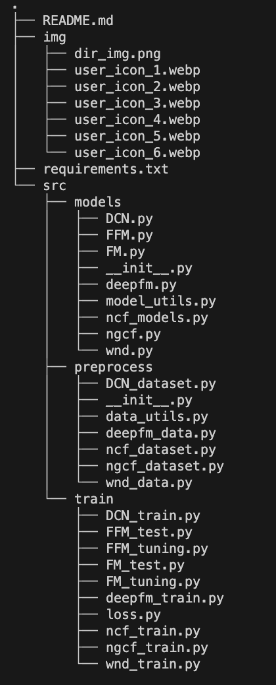

# Book Rating Prediction
## 사용자의 책 평점 데이터를 바탕으로 사용자가 어떤 책을 더 선호할지 예측하는 태스크


<br/>

## Team

| icon |  |  |  |  |  |  |
| :--: | :----------------------------------------------------------: | :----------------------------------------------------------: | :----------------------------------------------------------: | :----------------------------------------------------------: | :----------------------------------------------------------: | :----------------------------------------------------------: |
| 이름 |                            김민준                            |                            류지훈                            |                            한선우                            |                            양시영                            |                            이경민                            |                            신승훈                            |
| 담당 |                          EDA, Model                           |                          EDA, Model                          |                          EDA, Model                           |                          EDA, Model                           |                          EDA, Model                          |                          EDA, Model                          |
| 역할 |             Wide&Deep              |             FM, FFM               |               NCF,NerualMF                |             NGCF             |                   DCN                    |                     DeepFm                     |


<br/>

## 폴더구조




<br/>

## 프로젝트

### 목적

유저의 책 구매 결정에 도움을 주기 위한 추천 과제로 책과 관련된 정보와 유저의 정보, 그리고 유저가 실제로 부여한 평점을 활용하여 유저의 평점(0~10)을 예측하는 프로젝트입니다.

<br/>

### 데이터

- **train_ratings.csv**:  59,803명의 사용자(user)가 129,777개의 책(item)에 대해 남긴 306,795건의 평점(rating) 데이터 입니다.
- **test_ratings.csv**: test에 활용될 사용자(user)와 책(item) 목록입니다. 평점(rating)은 0으로 되어있습니다.
- **books.csv**: 149,570개의 책(item)에 대한 정보를 담고 있는 메타데이터입니다.
- **users.csv**: 68,092명의 고객(user)에 대한 정보를 담고 있는 메타데이터입니다.
<br/>

### 평가지표

**Root Mean Squared Error (RMSE)**

- **RMSE**는 예측값과 실제값 간의 평균 제곱 오차를 제곱근으로 계산하는 지표로, 모델의 예측 성능을 평가하는 데 사용됩니다.

- **RMSE**는 다음과 같이 정의됩니다:

  $$
  RMSE=\sqrt{\frac{1}{n}\sum_{i=1}^{n}(y_i-\hat{y}_i)^2}
  $$
  
  $$
  n : 데이터 개수, \\ \\  y_i : 레이팅 실제값, \\ \\ \hat{y}_i : 레이팅 예측값
  $$


<br/>

### 협업 방법

- 구글 공유 폴더: 회의록 작성 및 자료 공유
- Github: 코드 및 프로젝트 관리
- 기타 협업 툴 사용 (Zoom, Notion, Slack)


<br/>

### Feature Engineering

| 데이터 구분     | 의미                                                         | Features                            |
| --------------- | ------------------------------------------------------------ | ----------------------------------- |
| 유저        | 유저의 연령대                            | age_range          |
|                 | 유저의 나라                       | location_country |
|  | 유저의 사는 주           | location_state                     |
|                 | 유저의 사는도시                            | location_city            |
| 책               | 책의 언어 | language                       |


<br/>

### Install

python version: 3.9x

```
pip install -r requirements.txt
```


<br/>

### 코드 및 설명

- Fm & FFm
  - FM.py/FFM.py: FM/FFM 모델을 위한 데이터 전처리와 train dataset으로 validation하는 코드입니다.
  - FM_tuning.py/FFM_tuning.py: FM/FFM 모델의 하이퍼파라미터 튜닝을 하여 로그를 저장하는 코드입니다.
  - FM_test.py/FFM_test.py: 튜닝을 통해 얻어낸 최적의 파라미터로 FM/FFM 모델을 학습시켜 test data의 평점을 예측하는 코드입니다.
- DeepFm
  - deepfm_train.py: DeepFm을 트레인하고 튜닝하는 파일입니다.
  - deepfm_data.py: DeepFm 학습을 위한 데이터 가공 함수 및 데이터 불러오기 파일입니다.
  - deepfm.py: DeepFm 모델 아키텍쳐를 클래스로 담고있는 파일입니다.
- Wide & Deep
  - wnd.py : wide&deep을 수행하는 모델 코드입니다.
  - wnd_data.py : wide&deep을 수행하기 위한 데이터 전처리 코드입니다.
  - wnd_train.py : wide&deep 모델로 학습을 실행하는 코드입니다.
- DCN
  - DCN_train.py: DCN 모델을 학습하고 평가하며 최종적으로 예측 결과를 제출 파일로 저장하는 코드 (DCN model을 실행시키는 코드).
  - DCN_dataset.py: 데이터를 전처리하여 DCN 모델 학습에 적합한 형식으로 변환.
  - DCN.py: Deep Cross Network 모델 구조를 정의하고 구현된 코드.
- NGCF
  - ngcf_models.py: NGCF 모델 코드입니다.
  - ngcf_dataset.py: NGCF 모델 학습을 위한 데이터셋 코드 입니다.
  - ngcf_train.py: ngcf 모델을 학습 및 테스트하는 코드입니다.

- NCF: ncf_train.py을 통해 ncf model을 train 하는 파일입니다.
  - ncf_dataset.py : data 로드 후 정수형 인덱스 변환 코드입니다
  - ncf_model.py : ncf, neumf 모델을 정의한 코드입니다.
  - ncf_train.py : 모델 train 하는 코드입니다.


<br/>

### 최종 제출 결과

| Model      | validation RMSE | 리더보드 RMSE |
| ---------- | -------------- | ------------ |
| DeepFm   | 2.2102          | 2.20         |
| Wide & Deep    | 2.3841           | 2.19         |


<br/>